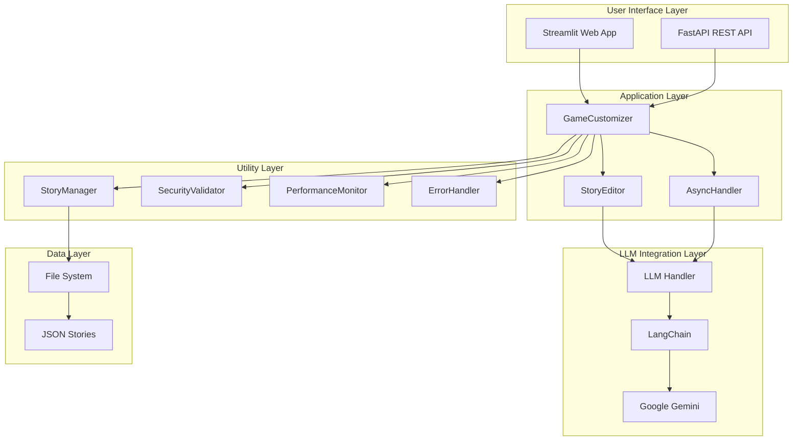
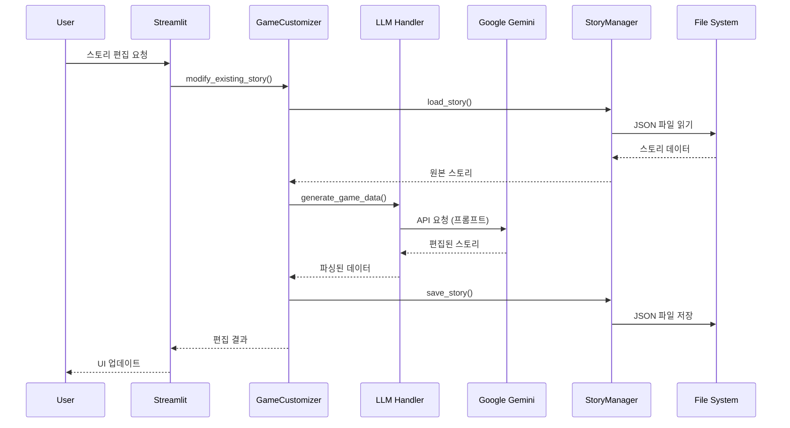
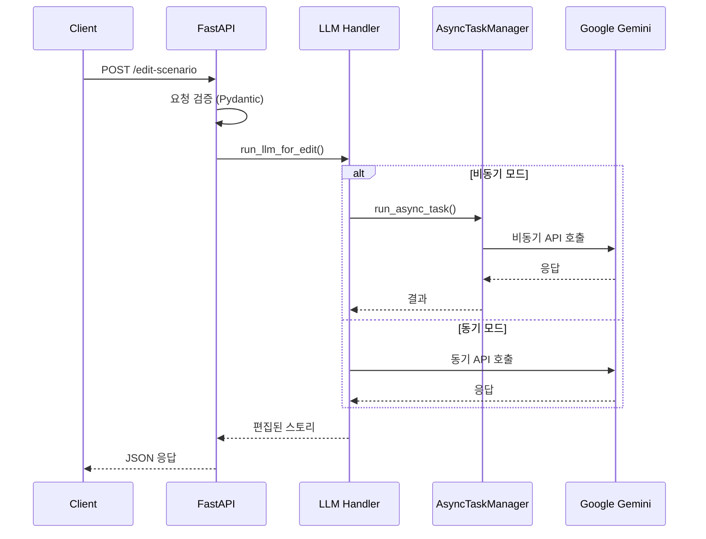

# 🎯 AI 스토리 편집 시스템 기술 아키텍처 및 구현 가이드

## 📋 목차
1. [프로젝트 개요](#1-프로젝트-개요)
2. [기술 스택 및 아키텍처](#2-기술-스택-및-아키텍처)
3. [LLM 통합 구현](#3-llm-통합-구현)
4. [FastAPI 서버 아키텍처](#4-fastapi-서버-아키텍처)
5. [비동기 처리 파이프라인](#5-비동기-처리-파이프라인)
6. [Streamlit UI 통합](#6-streamlit-ui-통합)
7. [데이터 플로우 및 처리 흐름](#7-데이터-플로우-및-처리-흐름)
8. [보안 및 검증 시스템](#8-보안-및-검증-시스템)
9. [성능 최적화 전략](#9-성능-최적화-전략)
10. [배포 및 운영](#10-배포-및-운영)

---

## 1. 프로젝트 개요

### 🎮 시스템 목적
- **투자 교육용 스토리 게임**의 AI 기반 실시간 편집 플랫폼
- **Google Gemini LLM**을 활용한 지능형 콘텐츠 수정
- **이중 인터페이스** 제공: Streamlit 웹앱 + FastAPI REST API

### 🏗️ 핵심 구성 요소
```
┌─────────────────┐    ┌─────────────────┐    ┌─────────────────┐
│  Streamlit UI   │◄──►│   Core Logic    │◄──►│   FastAPI API   │
│   (app.py)      │    │  (components/)  │    │   (main.py)     │
└─────────────────┘    └─────────────────┘    └─────────────────┘
         │                       │                       │
         ▼                       ▼                       ▼
┌─────────────────┐    ┌─────────────────┐    ┌─────────────────┐
│  UI Components  │    │  LLM Handler    │    │  Async Manager  │
│   (ui/)         │    │  (models/)      │    │  (utils/)       │
└─────────────────┘    └─────────────────┘    └─────────────────┘
```

---

## 2. 기술 스택 및 아키텍처

### 🔧 핵심 기술 스택

#### **AI/LLM 계층**
- **Google Gemini 2.5 Flash**: 메인 LLM 모델
- **LangChain**: LLM 추상화 및 통합 프레임워크
- **비동기 처리**: `asyncio` 기반 병렬 요청 처리

#### **백엔드 계층**
- **FastAPI**: 고성능 비동기 REST API 서버
- **Pydantic**: 데이터 검증 및 직렬화
- **Uvicorn**: ASGI 서버

#### **프론트엔드 계층**
- **Streamlit**: 인터랙티브 웹 애플리케이션
- **실시간 스트리밍**: LLM 응답 실시간 표시

#### **인프라 계층**
- **Docker**: 컨테이너화 배포
- **UV**: 패키지 관리
- **환경 격리**: 가상환경 기반 의존성 관리

### 🏛️ 시스템 아키텍처



---

## 3. LLM 통합 구현

### 🤖 LLM Handler 아키텍처

#### **핵심 컴포넌트**
```python
# source/models/llm_handler.py
class LLMHandler:
    ├── initialize_llm()           # 동기 초기화
    ├── initialize_llm_async()     # 비동기 초기화
    ├── generate_game_data()       # 동기 생성
    ├── generate_game_data_async() # 비동기 생성
    ├── generate_game_data_stream()# 스트리밍 생성
    └── generate_multiple_scenarios_async() # 병렬 생성
```

#### **LangChain 통합**
```python
def initialize_llm():
    """LangChain + Google Gemini 초기화"""
    api_key = load_api_key()
    settings = get_model_settings()
    
    llm = ChatGoogleGenerativeAI(
        model=settings["model_name"],          # gemini-2.5-flash-preview-05-20
        google_api_key=api_key,
        temperature=settings.get("temperature", 1.0),
        max_output_tokens=settings.get("max_tokens", 65000),
        top_p=settings.get("top_p", 0.9)
    )
    return llm
```

#### **비동기 LLM 처리**
```python
async def generate_game_data_async(prompt: str, llm=None):
    """비동기 LLM 요청 처리"""
    if llm is None:
        llm = await initialize_llm_async()
    
    try:
        # 비동기 LLM 호출
        messages = [SystemMessage(content=system_prompt),
                   HumanMessage(content=prompt)]
        
        response = await llm.ainvoke(messages)
        content = response.content
        
        # JSON 파싱 및 검증
        story_data = parse_and_validate_json(content)
        
        return story_data, metadata
    except Exception as e:
        raise Exception(f"비동기 LLM 생성 중 오류: {str(e)}")
```

### 🔄 스트리밍 구현

#### **실시간 응답 스트리밍**
```python
class StreamingCallbackHandler(BaseCallbackHandler):
    def __init__(self, container=None):
        self.container = container or st.empty()
        self.text = ""
    
    def on_llm_new_token(self, token: str, **kwargs):
        """새로운 토큰 실시간 표시"""
        self.text += token
        self.container.markdown(self.text)

def generate_game_data_stream(prompt: str, container):
    """스트리밍 모드로 LLM 응답 생성"""
    callback_handler = StreamingCallbackHandler(container)
    
    llm = ChatGoogleGenerativeAI(
        streaming=True,
        callbacks=[callback_handler]
    )
    
    return llm.invoke([HumanMessage(content=prompt)])
```

### 🎯 프롬프트 엔지니어링

#### **계층화된 프롬프트 시스템**
```python
# source/utils/prompts.py
def get_system_prompt():
    """기본 시스템 프롬프트"""
    return """당신은 10세 아동을 위한 투자 교육 스토리 편집 전문가입니다.

주요 역할:
1. 기존 스토리 데이터 분석 및 수정
2. 사용자 요청에 따른 특정 부분 편집
3. 아동 친화적 언어 유지
4. 투자 교육 목적 보존
5. JSON 구조 일관성 유지"""

def get_story_modification_prompt(original_story, user_request, type):
    """동적 수정 프롬프트 생성"""
    return f"""
기존 스토리: {original_story}
사용자 요청: {user_request}
수정 유형: {type}

수정 지침:
- 기존 구조 유지
- 요청 부분만 정확히 수정
- 교육적 가치 보존
"""
```

---

## 4. FastAPI 서버 아키텍처

### 🔌 API 서버 구조

#### **메인 애플리케이션**
```python
# main.py
app = FastAPI(
    title="Story Edit API",
    description="AI 기반 스토리 편집 API",
    version="1.0.0"
)

# 전역 컴포넌트
llm_model = None           # LLM 인스턴스
prompt_template = None     # 프롬프트 템플릿
task_manager = None        # 비동기 작업 관리자
```

#### **핵심 엔드포인트**
```python
@app.post("/edit-scenario", response_model=ScenarioResponse)
async def edit_scenario(request: StoryEditRequest):
    """메인 스토리 편집 엔드포인트"""
    
@app.get("/health")
async def health_check():
    """시스템 상태 확인"""
    
@app.get("/async-status")
async def async_status():
    """비동기 작업 상태 모니터링"""
    
@app.get("/performance")
async def performance_metrics():
    """성능 메트릭 조회"""
```

### 📨 요청/응답 모델

#### **Pydantic 스키마**
```python
class StoryEditRequest(BaseModel):
    chapterId: str        # 챕터 식별자
    story: str           # 원본 스토리 JSON
    editRequest: str     # 편집 요청 내용

class ScenarioResponse(BaseModel):
    chapterId: str       # 챕터 식별자
    story: str          # 편집된 스토리 JSON
    isCustom: bool      # 커스텀 여부
```

### 🚀 애플리케이션 라이프사이클

#### **시작 이벤트**
```python
@app.on_event("startup")
async def startup_event():
    """서버 시작시 초기화"""
    global llm_model, prompt_template, task_manager
    
    try:
        # API 키 검증
        api_key = load_api_key()
        if not api_key:
            raise ValueError("Google API 키가 설정되지 않았습니다.")
        
        # 비동기 작업 관리자 초기화
        task_manager = AsyncTaskManager()
        
        # LLM 모델 비동기 초기화
        llm_model = await initialize_llm_async()
        
        # 프롬프트 템플릿 생성
        system_prompt = get_system_prompt()
        prompt_template = create_prompt_template(system_prompt)
        
        logger.info("FastAPI 서버 초기화 완료")
        
    except Exception as e:
        logger.error(f"서버 초기화 실패: {e}")
        # 동기 방식으로 폴백
        llm_model = initialize_llm()
```

#### **종료 이벤트**
```python
@app.on_event("shutdown")
async def shutdown_event():
    """서버 종료시 리소스 정리"""
    global task_manager
    
    if task_manager:
        await task_manager.cleanup()
        logger.info("비동기 작업 관리자 정리 완료")
```

---

## 5. 비동기 처리 파이프라인

### ⚡ AsyncTaskManager 아키텍처

#### **비동기 작업 관리**
```python
# source/utils/async_handler.py
class AsyncTaskManager:
    def __init__(self):
        self.tasks = {}              # 실행 중인 작업들
        self.results = {}            # 작업 결과들
        self.executor = ThreadPoolExecutor(max_workers=4)
    
    def run_async_task(self, task_id: str, async_func: Callable):
        """비동기 작업 백그라운드 실행"""
        def run_in_thread():
            loop = asyncio.new_event_loop()
            asyncio.set_event_loop(loop)
            try:
                result = loop.run_until_complete(async_func(*args, **kwargs))
                self.results[task_id] = {'status': 'completed', 'result': result}
            except Exception as e:
                self.results[task_id] = {'status': 'error', 'error': str(e)}
            finally:
                loop.close()
        
        self.results[task_id] = {'status': 'running'}
        future = self.executor.submit(run_in_thread)
        self.tasks[task_id] = future
        return task_id
```

### 🔄 병렬 처리 패턴

#### **다중 시나리오 생성**
```python
async def generate_multiple_scenarios_async(
    prompts: List[str], 
    llm: Optional[ChatGoogleGenerativeAI] = None,
    max_concurrent: int = 3
) -> List[tuple]:
    """여러 시나리오를 병렬로 비동기 생성"""
    
    if llm is None:
        llm = await initialize_llm_async()
    
    # 세마포어로 동시 실행 수 제한
    semaphore = asyncio.Semaphore(max_concurrent)
    
    async def generate_single(prompt: str):
        async with semaphore:
            return await generate_game_data_async(prompt, llm)
    
    # 모든 프롬프트를 병렬로 처리
    tasks = [generate_single(prompt) for prompt in prompts]
    results = await asyncio.gather(*tasks, return_exceptions=True)
    
    return results
```

### 🔀 Streamlit 비동기 통합

#### **이벤트 루프 관리**
```python
def run_async_in_streamlit(coroutine: Coroutine) -> Any:
    """Streamlit에서 비동기 함수 실행"""
    try:
        loop = asyncio.get_event_loop()
        if loop.is_running():
            # 이미 실행 중인 루프 → 새 스레드에서 실행
            def run_in_thread():
                new_loop = asyncio.new_event_loop()
                asyncio.set_event_loop(new_loop)
                try:
                    return new_loop.run_until_complete(coroutine)
                finally:
                    new_loop.close()
            
            with ThreadPoolExecutor() as executor:
                future = executor.submit(run_in_thread)
                return future.result()
        else:
            return loop.run_until_complete(coroutine)
    except RuntimeError:
        return asyncio.run(coroutine)
```

---

## 6. Streamlit UI 통합

### 🎨 UI 컴포넌트 아키텍처

#### **모듈화된 UI 구조**
```
source/ui/
├── sidebar.py              # 사이드바 및 설정
├── story_selector.py       # 스토리 선택 인터페이스
├── chat_interface.py       # AI 채팅 인터페이스
├── story_viewer.py         # 스토리 미리보기
├── info_tabs.py           # 정보 및 가이드 탭
└── system_management.py   # 시스템 관리 UI
```

#### **메인 애플리케이션 흐름**
```python
# app.py
def main():
    """메인 애플리케이션 로직"""
    try:
        # 페이지 설정
        setup_page()
        
        # 세션 상태 초기화
        initialize_session_state()
        
        # API 키 확인
        check_api_key()
        
        # 성능 모니터링 시작
        performance_monitor.start_timer("main_app")
        
        # 사이드바 렌더링
        render_sidebar()
        
        # 조건부 UI 렌더링
        if st.session_state.get('show_system_management'):
            render_system_management()
            return
        
        if not st.session_state.get('current_game_data'):
            render_story_selector()
            return
        
        # 메인 편집 인터페이스
        col1, col2 = st.columns([1, 1])
        
        with col1:
            st.subheader("💬 AI 스토리 편집기")
            render_chat_interface(st.session_state.customizer)
        
        with col2:
            st.subheader("📖 스토리 미리보기")
            render_story_viewer(st.session_state.customizer)
        
        render_info_tabs()
        
    finally:
        performance_monitor.end_timer("main_app")
```

### 💬 채팅 인터페이스

#### **AI 편집 채팅**
```python
# source/ui/chat_interface.py
def render_chat_interface(customizer):
    """AI 편집 채팅 인터페이스"""
    
    # 채팅 히스토리 표시
    for message in st.session_state.chat_history:
        with st.chat_message(message["role"]):
            st.markdown(message["content"])
    
    # 사용자 입력
    if prompt := st.chat_input("어떻게 스토리를 수정하고 싶으신가요?"):
        # 사용자 메시지 추가
        st.session_state.chat_history.append({
            "role": "user", 
            "content": prompt
        })
        
        with st.chat_message("user"):
            st.markdown(prompt)
        
        # AI 응답 생성
        with st.chat_message("assistant"):
            with st.spinner("스토리를 편집하고 있습니다..."):
                try:
                    # 스트리밍 모드 또는 일반 모드
                    if st.session_state.get('streaming_mode', False):
                        response_container = st.empty()
                        result = customizer.modify_story_stream(
                            st.session_state.current_story_name,
                            prompt,
                            response_container
                        )
                    else:
                        result, metadata = customizer.modify_existing_story(
                            st.session_state.current_story_name,
                            prompt,
                            st.session_state.chat_history
                        )
                    
                    if result:
                        st.success("✅ 스토리가 성공적으로 수정되었습니다!")
                        # 세션 상태 업데이트
                        st.session_state.current_game_data = result
                        
                        # AI 응답 메시지 추가
                        st.session_state.chat_history.append({
                            "role": "assistant",
                            "content": "스토리를 수정했습니다. 오른쪽 미리보기에서 확인해보세요!"
                        })
                    
                except Exception as e:
                    st.error(f"편집 중 오류가 발생했습니다: {str(e)}")
```

### 📖 스토리 뷰어

#### **실시간 미리보기**
```python
# source/ui/story_viewer.py
def render_story_viewer(customizer):
    """스토리 미리보기 및 편집 인터페이스"""
    
    if not st.session_state.get('current_game_data'):
        st.info("편집할 스토리를 선택해주세요.")
        return
    
    story_data = st.session_state.current_game_data
    
    # 스토리 메타데이터 표시
    st.markdown("### 📊 스토리 정보")
    col1, col2, col3 = st.columns(3)
    
    with col1:
        st.metric("총 턴 수", len(story_data))
    with col2:
        total_stocks = sum(len(turn.get('stocks', [])) for turn in story_data)
        st.metric("총 주식 수", total_stocks)
    with col3:
        story_name = st.session_state.get('current_story_name', 'Unknown')
        st.metric("스토리", story_name.replace('_', ' ').title())
    
    # 턴별 스토리 표시
    st.markdown("### 📚 스토리 내용")
    
    for i, turn in enumerate(story_data):
        with st.expander(f"🎮 턴 {turn.get('turn_number', i+1)}", expanded=(i == 0)):
            # 턴 결과 표시
            st.markdown("**📖 상황:**")
            st.write(turn.get('result', 'N/A'))
            
            # 뉴스 표시
            if 'news' in turn:
                st.markdown("**📰 뉴스:**")
                st.info(turn['news'])
            
            # 주식 정보 표시
            if 'stocks' in turn and turn['stocks']:
                st.markdown("**📈 주식 정보:**")
                for stock in turn['stocks']:
                    col1, col2, col3 = st.columns(3)
                    with col1:
                        st.write(f"**{stock.get('name', 'N/A')}**")
                    with col2:
                        before = stock.get('before_value', 0)
                        current = stock.get('current_value', 0)
                        change = current - before
                        color = "🔴" if change < 0 else "🟢" if change > 0 else "🟡"
                        st.write(f"{color} {before} → {current}")
                    with col3:
                        st.write(f"위험도: {stock.get('risk_level', 'N/A')}")
```

---

## 7. 데이터 플로우 및 처리 흐름

### 🔄 전체 데이터 플로우



### 📊 FastAPI 요청 플로우



### 🧩 컴포넌트 간 상호작용

#### **GameCustomizer 중심 아키텍처**
```python
class GameCustomizer:
    """스토리 편집의 중심 컨트롤러"""
    
    def __init__(self):
        self.llm = None                    # LLM 인스턴스
        self.story_editor = StoryEditor()  # 스토리 편집 로직
        self.chatbot_helper = ChatbotHelper()  # 채팅 도우미
        self.async_manager = AsyncTaskManager()  # 비동기 관리자
    
    def modify_existing_story(self, story_name: str, user_request: str):
        """스토리 수정 메인 로직"""
        
        # 1. 보안 검증
        security_result = security_validator.validate_content_security(user_request)
        if not security_result["is_safe"]:
            return None, {"error": "보안 검증 실패"}
        
        # 2. 원본 스토리 로드
        original_story = self.story_editor.load_story(story_name)
        
        # 3. 수정 요청 분석
        modification_analysis = self.story_editor.analyze_modification_request(user_request)
        
        # 4. 프롬프트 생성
        prompt = self._create_modification_prompt(original_story, user_request, modification_analysis)
        
        # 5. LLM 요청 실행
        try:
            result, metadata = generate_game_data(prompt, self.llm)
            
            # 6. 결과 검증 및 저장
            if self._validate_story_structure(result):
                self.story_editor.save_story(result, story_name)
                return result, metadata
            else:
                return None, {"error": "스토리 구조 검증 실패"}
                
        except Exception as e:
            logger.error(f"LLM 요청 실패: {e}")
            return None, {"error": str(e)}
```

---

## 8. 보안 및 검증 시스템

### 🔒 보안 검증 파이프라인

#### **SecurityValidator 아키텍처**
```python
# source/utils/security.py
class SecurityValidator:
    """보안 검증 및 콘텐츠 필터링"""
    
    def validate_content_security(self, content: str) -> Dict[str, Any]:
        """종합적인 콘텐츠 보안 검증"""
        issues = []
        
        # 1. 금지된 키워드 검사
        forbidden_keywords = [
            '실제 투자', '금융 조언', '주식 추천',
            '악성코드', '해킹', '보안 위협'
        ]
        
        for keyword in forbidden_keywords:
            if keyword in content.lower():
                issues.append(f"금지된 키워드 발견: {keyword}")
        
        # 2. 길이 제한 검사
        if len(content) > 10000:
            issues.append("입력 내용이 너무 깁니다")
        
        # 3. 특수 문자 패턴 검사
        dangerous_patterns = [
            r'<script.*?>',  # 스크립트 태그
            r'javascript:',  # 자바스크립트 실행
            r'eval\(',      # eval 함수
        ]
        
        for pattern in dangerous_patterns:
            if re.search(pattern, content, re.IGNORECASE):
                issues.append(f"위험한 패턴 발견: {pattern}")
        
        return {
            "is_safe": len(issues) == 0,
            "issues": issues,
            "content_length": len(content)
        }
    
    def sanitize_input(self, content: str) -> str:
        """입력 내용 정화"""
        # HTML 태그 제거
        content = re.sub(r'<[^>]+>', '', content)
        
        # 특수 문자 이스케이프
        content = content.replace('<', '&lt;').replace('>', '&gt;')
        
        # 불필요한 공백 정리
        content = re.sub(r'\s+', ' ', content).strip()
        
        return content
```

### ✅ 데이터 검증 시스템

#### **스토리 구조 검증**
```python
def validate_story_structure(self, story_data) -> bool:
    """스토리 데이터 구조 검증"""
    try:
        if not isinstance(story_data, list):
            logger.error("스토리 데이터가 리스트가 아닙니다")
            return False
        
        # 필수 턴 수 확인 (7턴)
        if len(story_data) != 7:
            logger.error(f"턴 수가 잘못되었습니다: {len(story_data)}")
            return False
        
        # 각 턴의 필수 필드 검증
        required_fields = ['turn_number', 'result', 'news', 'stocks']
        
        for i, turn in enumerate(story_data):
            if not isinstance(turn, dict):
                logger.error(f"턴 {i+1}이 딕셔너리가 아닙니다")
                return False
            
            for field in required_fields:
                if field not in turn:
                    logger.error(f"턴 {i+1}에 필수 필드 '{field}'가 없습니다")
                    return False
            
            # 주식 데이터 검증
            stocks = turn.get('stocks', [])
            if not isinstance(stocks, list):
                logger.error(f"턴 {i+1}의 주식 데이터가 리스트가 아닙니다")
                return False
            
            for stock in stocks:
                stock_fields = ['name', 'risk_level', 'before_value', 'current_value']
                for field in stock_fields:
                    if field not in stock:
                        logger.error(f"주식 데이터에 필수 필드 '{field}'가 없습니다")
                        return False
        
        return True
        
    except Exception as e:
        logger.error(f"스토리 구조 검증 중 오류: {e}")
        return False
```

---

## 9. 성능 최적화 전략

### ⚡ 성능 모니터링

#### **PerformanceMonitor 시스템**
```python
# source/utils/performance.py
class PerformanceMonitor:
    """성능 모니터링 및 최적화"""
    
    def __init__(self):
        self.timers = {}           # 타이머 저장소
        self.metrics = {}          # 메트릭 저장소
        self.cache = {}            # 간단한 캐시
        self.cache_max_size = 100  # 캐시 최대 크기
    
    def start_timer(self, name: str):
        """타이머 시작"""
        self.timers[name] = time.time()
    
    def end_timer(self, name: str) -> float:
        """타이머 종료 및 경과 시간 반환"""
        if name in self.timers:
            duration = time.time() - self.timers[name]
            self._record_metric(name, duration)
            del self.timers[name]
            return duration
        return 0.0
    
    def _record_metric(self, name: str, value: float):
        """메트릭 기록"""
        if name not in self.metrics:
            self.metrics[name] = []
        
        self.metrics[name].append({
            'value': value,
            'timestamp': time.time()
        })
        
        # 메트릭 개수 제한 (최근 100개만 유지)
        if len(self.metrics[name]) > 100:
            self.metrics[name] = self.metrics[name][-100:]
    
    def get_average_time(self, name: str) -> float:
        """평균 실행 시간 계산"""
        if name not in self.metrics:
            return 0.0
        
        values = [m['value'] for m in self.metrics[name]]
        return sum(values) / len(values) if values else 0.0
    
    def cache_get(self, key: str):
        """캐시에서 값 조회"""
        return self.cache.get(key)
    
    def cache_set(self, key: str, value: Any):
        """캐시에 값 저장"""
        if len(self.cache) >= self.cache_max_size:
            # 가장 오래된 항목 제거 (간단한 LRU)
            oldest_key = next(iter(self.cache))
            del self.cache[oldest_key]
        
        self.cache[key] = value
```

### 🔄 캐싱 전략

#### **LLM 응답 캐싱**
```python
def generate_with_cache(self, prompt: str, cache_key: str = None):
    """캐시 기능이 있는 LLM 생성"""
    
    if cache_key is None:
        cache_key = hashlib.md5(prompt.encode()).hexdigest()
    
    # 캐시에서 확인
    cached_result = performance_monitor.cache_get(cache_key)
    if cached_result:
        logger.info(f"캐시에서 결과 반환: {cache_key[:8]}...")
        return cached_result
    
    # 캐시 미스 - 새로 생성
    performance_monitor.start_timer("llm_generation")
    result, metadata = generate_game_data(prompt, self.llm)
    duration = performance_monitor.end_timer("llm_generation")
    
    # 결과를 캐시에 저장
    performance_monitor.cache_set(cache_key, (result, metadata))
    
    logger.info(f"LLM 생성 완료 ({duration:.2f}초), 캐시 저장: {cache_key[:8]}...")
    return result, metadata
```

### 📊 비동기 성능 최적화

#### **연결 풀링 및 세마포어**
```python
async def optimize_concurrent_requests():
    """동시 요청 최적화"""
    
    # 1. 세마포어로 동시 요청 수 제한
    MAX_CONCURRENT = 3
    semaphore = asyncio.Semaphore(MAX_CONCURRENT)
    
    # 2. 커넥션 풀 설정
    timeout = aiohttp.ClientTimeout(total=30)
    connector = aiohttp.TCPConnector(
        limit=100,           # 전체 연결 풀 크기
        limit_per_host=30,   # 호스트당 연결 수
        ttl_dns_cache=300,   # DNS 캐시 TTL
        use_dns_cache=True,
    )
    
    # 3. 배치 처리
    BATCH_SIZE = 5
    async def process_batch(batch):
        async with semaphore:
            tasks = [process_single(item) for item in batch]
            return await asyncio.gather(*tasks, return_exceptions=True)
    
    # 4. 백프레셔 제어
    queue = asyncio.Queue(maxsize=50)
    
    return {
        'semaphore': semaphore,
        'connector': connector,
        'batch_processor': process_batch,
        'queue': queue
    }
```

---

## 10. 배포 및 운영

### 🐳 Docker 컨테이너화

#### **멀티 스테이지 Dockerfile**
```dockerfile
# Dockerfile
FROM python:3.10-slim as base

# 시스템 패키지 설치
RUN apt-get update && apt-get install -y \
    curl \
    && rm -rf /var/lib/apt/lists/*

# 보안을 위한 non-root 사용자 생성
RUN groupadd -r appgroup && useradd -r -g appgroup appuser

# 작업 디렉토리 설정
WORKDIR /app

# 의존성 파일 복사 및 설치
COPY requirements.txt .
RUN pip install --no-cache-dir -r requirements.txt

# 애플리케이션 파일 복사
COPY --chown=appuser:appgroup . .

# 필요한 디렉토리 생성 및 권한 설정
RUN mkdir -p saved_stories logs && \
    chown -R appuser:appgroup saved_stories logs && \
    chmod 755 saved_stories logs

# non-root 사용자로 전환
USER appuser

# 포트 노출
EXPOSE 8501 8000

# 헬스체크 설정
HEALTHCHECK --interval=30s --timeout=10s --start-period=40s --retries=3 \
    CMD curl -f http://localhost:8000/health || exit 1

# 엔트리포인트 스크립트 사용
ENTRYPOINT ["docker-entrypoint.sh"]
CMD ["streamlit"]
```

#### **Docker Compose 구성**
```yaml
# docker-compose.yml
version: '3.8'

services:
  # Streamlit 웹 앱
  streamlit:
    build: .
    ports:
      - "8501:8501"
    environment:
      - GOOGLE_API_KEY=${GOOGLE_API_KEY}
      - GOOGLE_MODEL=${GOOGLE_MODEL:-gemini-2.5-flash-preview-05-20}
      - ENVIRONMENT=production
    volumes:
      - ./saved_stories:/app/saved_stories
      - ./logs:/app/logs
    command: ["streamlit"]
    healthcheck:
      test: ["CMD", "curl", "-f", "http://localhost:8501/healthz"]
      interval: 30s
      timeout: 10s
      retries: 3
    restart: unless-stopped

  # FastAPI 서버
  fastapi:
    build: .
    ports:
      - "8000:8000"
    environment:
      - GOOGLE_API_KEY=${GOOGLE_API_KEY}
      - GOOGLE_MODEL=${GOOGLE_MODEL:-gemini-2.5-flash-preview-05-20}
      - ENVIRONMENT=production
    volumes:
      - ./saved_stories:/app/saved_stories
      - ./logs:/app/logs
    command: ["fastapi"]
    healthcheck:
      test: ["CMD", "curl", "-f", "http://localhost:8000/health"]
      interval: 30s
      timeout: 10s
      retries: 3
    restart: unless-stopped
    depends_on:
      - streamlit

  # 로그 수집 (선택사항)
  logspout:
    image: gliderlabs/logspout:latest
    ports:
      - "8080:80"
    volumes:
      - /var/run/docker.sock:/var/run/docker.sock
    command: syslog://logs:514
    depends_on:
      - streamlit
      - fastapi
```

### 🚀 배포 스크립트

#### **엔트리포인트 스크립트**
```bash
#!/bin/bash
# docker-entrypoint.sh

# 환경 변수 확인
check_env_vars() {
    if [ -z "$GOOGLE_API_KEY" ]; then
        echo "❌ GOOGLE_API_KEY 환경 변수가 설정되지 않았습니다"
        exit 1
    fi
    echo "✅ 환경 변수 확인 완료"
}

# 디렉토리 설정
setup_directories() {
    echo "📁 필요한 디렉토리를 생성합니다..."
    mkdir -p saved_stories logs
    chmod 755 saved_stories logs 2>/dev/null || true
    echo "✅ 디렉토리 설정 완료"
}

# 애플리케이션 시작
start_application() {
    case "$1" in
        "streamlit")
            echo "🚀 Streamlit 앱 시작 중..."
            exec streamlit run app.py \
                --server.address=0.0.0.0 \
                --server.port=8501 \
                --server.headless=true \
                --server.fileWatcherType=none \
                --browser.gatherUsageStats=false
            ;;
        "fastapi")
            echo "🚀 FastAPI 서버 시작 중..."
            exec uvicorn main:app \
                --host 0.0.0.0 \
                --port 8000 \
                --workers 1 \
                --loop asyncio \
                --log-level info
            ;;
        "both")
            echo "🚀 Streamlit과 FastAPI 동시 시작 중..."
            # FastAPI 백그라운드 실행
            uvicorn main:app --host 0.0.0.0 --port 8000 --workers 1 --loop asyncio &
            # Streamlit 포어그라운드 실행
            exec streamlit run app.py \
                --server.address=0.0.0.0 \
                --server.port=8501 \
                --server.headless=true \
                --server.fileWatcherType=none \
                --browser.gatherUsageStats=false
            ;;
        *)
            echo "❌ 알 수 없는 서비스: $1"
            exit 1
            ;;
    esac
}

# 메인 실행
main() {
    echo "🐳 AI 스토리 편집 시스템 시작"
    echo "================================"
    
    check_env_vars
    setup_directories
    
    SERVICE=${1:-streamlit}
    start_application "$SERVICE"
}

main "$@"
```

### 📊 모니터링 및 로깅

#### **구조화된 로깅**
```python
# 로깅 설정
import logging
import sys
from datetime import datetime

def setup_logging():
    """운영환경용 로깅 설정"""
    
    # 로그 포맷 설정
    formatter = logging.Formatter(
        '%(asctime)s - %(name)s - %(levelname)s - %(funcName)s:%(lineno)d - %(message)s'
    )
    
    # 콘솔 핸들러
    console_handler = logging.StreamHandler(sys.stdout)
    console_handler.setLevel(logging.INFO)
    console_handler.setFormatter(formatter)
    
    # 파일 핸들러
    file_handler = logging.FileHandler(
        f'logs/app_{datetime.now().strftime("%Y%m%d")}.log',
        encoding='utf-8'
    )
    file_handler.setLevel(logging.DEBUG)
    file_handler.setFormatter(formatter)
    
    # 에러 전용 핸들러
    error_handler = logging.FileHandler(
        f'logs/error_{datetime.now().strftime("%Y%m%d")}.log',
        encoding='utf-8'
    )
    error_handler.setLevel(logging.ERROR)
    error_handler.setFormatter(formatter)
    
    # 루트 로거 설정
    root_logger = logging.getLogger()
    root_logger.setLevel(logging.DEBUG)
    root_logger.addHandler(console_handler)
    root_logger.addHandler(file_handler)
    root_logger.addHandler(error_handler)
    
    return root_logger
```

#### **헬스체크 엔드포인트**
```python
@app.get("/health")
async def health_check():
    """종합적인 시스템 상태 확인"""
    
    health_status = {
        "status": "healthy",
        "timestamp": datetime.utcnow().isoformat(),
        "version": "1.0.0",
        "components": {}
    }
    
    # LLM 모델 상태 확인
    try:
        if llm_model:
            health_status["components"]["llm"] = "operational"
        else:
            health_status["components"]["llm"] = "not_initialized"
            health_status["status"] = "degraded"
    except Exception as e:
        health_status["components"]["llm"] = f"error: {str(e)}"
        health_status["status"] = "unhealthy"
    
    # 비동기 작업 관리자 상태
    try:
        if task_manager:
            active_tasks = task_manager.get_active_task_count()
            health_status["components"]["async_manager"] = {
                "status": "operational",
                "active_tasks": active_tasks
            }
        else:
            health_status["components"]["async_manager"] = "not_initialized"
    except Exception as e:
        health_status["components"]["async_manager"] = f"error: {str(e)}"
        health_status["status"] = "unhealthy"
    
    # 파일 시스템 접근 확인
    try:
        import os
        if os.path.exists("saved_stories") and os.access("saved_stories", os.W_OK):
            health_status["components"]["storage"] = "operational"
        else:
            health_status["components"]["storage"] = "not_accessible"
            health_status["status"] = "degraded"
    except Exception as e:
        health_status["components"]["storage"] = f"error: {str(e)}"
        health_status["status"] = "unhealthy"
    
    # 전체 상태에 따른 HTTP 상태 코드 설정
    status_code = 200
    if health_status["status"] == "degraded":
        status_code = 206  # Partial Content
    elif health_status["status"] == "unhealthy":
        status_code = 503  # Service Unavailable
    
    return JSONResponse(content=health_status, status_code=status_code)
```

---

## 🎯 결론

### 🏆 핵심 기술적 성과

1. **완전한 비동기 파이프라인**: LLM API 호출부터 UI 업데이트까지 전 과정 비동기화
2. **이중 인터페이스 아키텍처**: Streamlit UI + FastAPI 백엔드로 다양한 사용 사례 지원
3. **강력한 보안 시스템**: 다층 보안 검증 및 콘텐츠 필터링
4. **성능 최적화**: 캐싱, 연결 풀링, 배치 처리 등 종합적 최적화
5. **운영 준비**: Docker 컨테이너화, 모니터링, 로깅 시스템 완비

### 🚀 확장 가능성

- **Redis 캐싱**: 분산 캐시로 성능 향상
- **WebSocket**: 실시간 양방향 통신
- **마이크로서비스**: 기능별 서비스 분리
- **AI 모델 확장**: 다양한 LLM 모델 지원
- **다국어 지원**: 국제화(i18n) 구현

이 시스템은 현대적인 AI 애플리케이션 아키텍처의 모범 사례를 구현하며, 확장성과 유지보수성을 모두 고려한 설계로 구성되어 있습니다.
